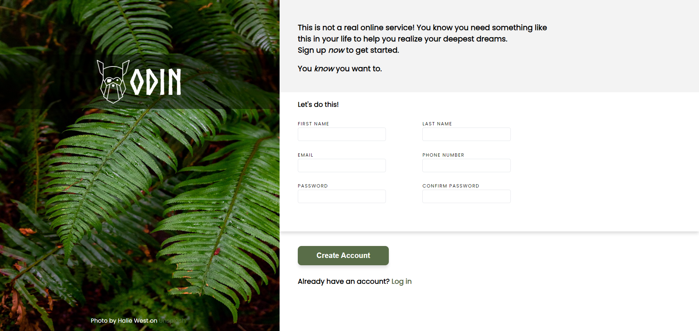

## Table of contents

- [Overview](#overview)
  - [The challenge](#the-challenge)
  - [Features](#features)
  - [Screenshots](#screenshots)
- [My process](#my-process)
  - [Built with](#built-with)

## Overview

### The challenge

- Created a sign-up form as part of [The Odin Project](https://www.theodinproject.com)
- Live demo: https://itskharina.github.io/sign-up-form/

### Features

- Alert box when user tries to submit with incomplete/empty inputs
- Checks if 'password' and 'confirm password' inputs match

### Screenshots

## My process

### Built with

- HTML
- CSS (Flexbox)
- JavaScript
